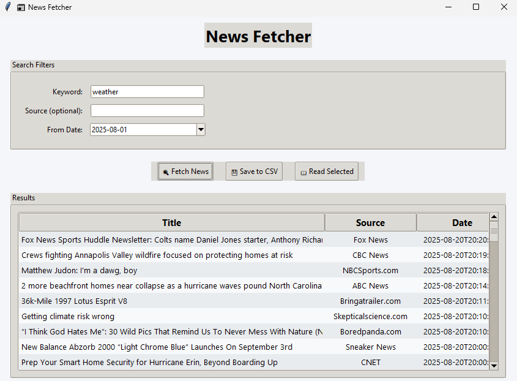

# 📰 News Fetcher GUI

A Python desktop app that fetches real-time news using the **NewsAPI**, 
with filters, sentiment analysis, and a clean Tkinter GUI.

## 📸 Screenshot
Here’s how the app looks in action:




## ✨ Features
- Search news by **keyword**, **source**, and **date**
- Interactive GUI with **table view**
- Double-click headlines to read full article
- Save results as **CSV, Excel, or JSON**
- **Sentiment analysis** (positive / negative / neutral)
- Optional **dark mode**

## 🛠️ Tech Stack
- Python (Tkinter, ttkbootstrap, pandas, requests, nltk, pillow, tkcalendar)
- NewsAPI

## 🚀 Getting Started
1. Clone repo:
   ```bash
   git clone https://github.com/YOUR-USERNAME/News-Fetcher-GUI.git
   cd News-Fetcher-GUI
